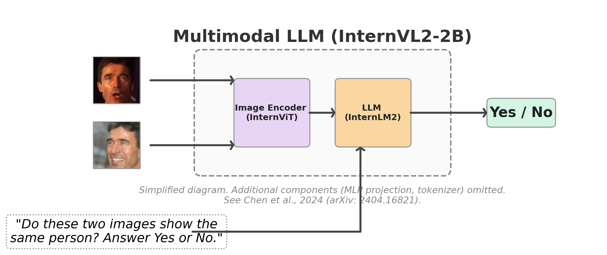
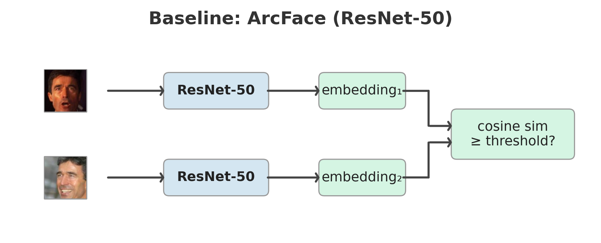
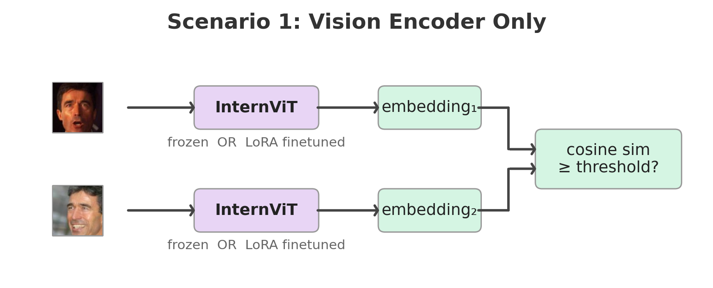
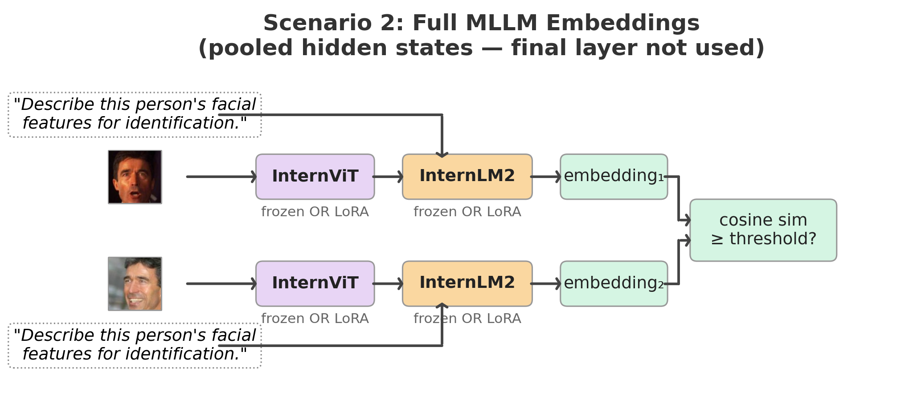
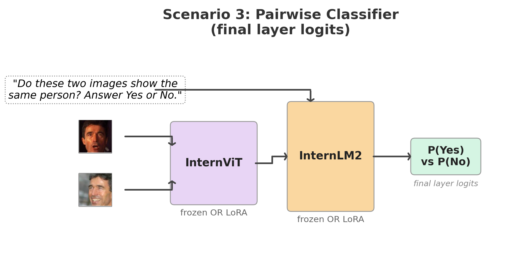

# LoRA‑tuning a multimodal LLM for face verification
<h2>Comparing a vision‑only encoder, full multimodal embeddings, and pairwise LLM prompting under the same training and evaluation setup.</h2>
<p align="center">
  
</p>

<table align="center">
  <tr>
    <td align="center"></td>
    <td align="center"></td>
  </tr>
  <tr>
    <td align="center"></td>
    <td align="center"></td>
  </tr>
  <tr>
    <td colspan="2" align="center"><em>Three ways to extract face identity from a 2-billion-parameter multimodal model. None beat a ResNet-50 trained from scratch.</em></td>
  </tr>
</table>

Builds on a [previous project](https://github.com/enazari/ArcFace-vs-InfoNCE) that established InfoNCE and ArcFace baselines on the same data and evaluation protocol.

**Key findings:**
- In this setting, multimodal LLMs do not match task-specific encoders for face verification, even after parameter-efficient finetuning.
- The limitation appears to be architectural: despite contrastive finetuning, identity information may be degraded by the multimodal pipeline and is difficult to fully recover from representations pretrained for language modeling.
- Language fusion tends to reduce identity signal: adding the LLM slightly underperforms a vision-only encoder in our experiments.
- CNN baselines remain strong: a ResNet-50 trained from scratch matches or slightly exceeds all 2B-parameter MLLM variants evaluated here.

## Results

All models trained on MS1M-ArcFace (85K identities), evaluated with 10-fold cross-validation at FAR@0.001.

| Experiment | Loss | LFW | CFP-FF | CFP-FP |
|-----------|------|-----|--------|--------|
| $\color{darkgreen}{\textbf{ResNet-50 — baseline}}$ | $\color{darkgreen}{\textbf{InfoNCE}}$ | $\color{darkgreen}{\textbf{99.55\%}}$ | $\color{darkgreen}{\textbf{99.59\%}}$ | $\color{darkgreen}{\textbf{87.87\%}}$ |
| InternViT-300M (frozen) | InfoNCE | 66.12% | 54.34% | 51.76% |
| **InternViT-300M + LoRA** | **InfoNCE** | **99.02%** | **97.60%** | **87.07%** |
| InternVL2-2B (frozen) | InfoNCE | 60.12% | 53.17% | 50.86% |
| **InternVL2-2B + LoRA** | **InfoNCE** | **98.68%** | **98.09%** | **84.20%** |
| InternVL2-2B pairwise (frozen) | Cross-entropy | 50.00% | 50.40% | 50.03% |
| InternVL2-2B pairwise + LoRA | Cross-entropy | 73.03% | 65.77% | 56.56% |

### InfoNCE loss

<p align="center">
  
</p>

Each batch contains P identity pairs (2 images per identity). InfoNCE maximizes cosine similarity between partners while pushing apart the 2P&minus;2 non-partner images, using temperature-scaled softmax over the similarity matrix. All MLLM experiments in this project use InfoNCE (&tau;=0.07). The same ResNet-50 baseline trained with ArcFace loss reaches 99.72% LFW / 95.84% CFP-FP &mdash; see the [ArcFace vs InfoNCE project](https://github.com/enazari/ArcFace-vs-InfoNCE) for an extended comparison of loss functions on the same backbone and data.

### Scenario 1: How much face-identity signal is already present in the vision encoder of a pretrained multimodal model, and how far can parameter-efficient finetuning push it for verification?

The ViT was pretrained jointly with the LLM on multimodal data &mdash; not faces. Frozen, it scores 66% on LFW (near chance). But rank-8 LoRA adapters on just the FFN layers (`fc1`, `fc2`) lift it to 99.02% on LFW and 87.07% on CFP-FP &mdash; nearly matching the ResNet-50 baseline (99.55% / 87.87%) &mdash; by training only 1.97M parameters (0.64% of the model). The raw signal is weak, but the representation is highly adaptable. Adapters are kept in float32 while the 306M base stays frozen in fp16 &mdash; without this, optimizer states for small rank-8 matrices can accumulate rounding errors that may stall training.

### Scenario 2: Does the language stack in a multimodal LLM improve identity-discriminative visual representations for face verification?

It dilutes them. InternVL2-2B + LoRA (full MLLM) slightly *underperforms* InternViT + LoRA (ViT only) &mdash; 98.68% vs 99.02% on LFW, 84.20% vs 87.07% on CFP-FP. I think this comes down to two things. First, the pipeline between ViT and LLM is lossy: pixel unshuffle reduces 1,024 visual tokens to 256, and the MLP projector was trained to align visual tokens with language tokens for captioning &mdash; not to preserve identity-discriminative spatial information. The ViT alone retains more of what faces need. Second, the LLM&rsquo;s hidden states are shaped by a next-token prediction objective, not by metric learning &mdash; pooling them into a face embedding repurposes a representation that was never designed for pairwise similarity.

### Scenario 3: Can the LLM&rsquo;s internally fused representation of two face images improve verification over independently encoded embeddings and a downstream similarity metric?

No. Prompting the MLLM with two images and &ldquo;Do these two images show the same person?&rdquo; is the most natural use of an LLM for verification. It is also the worst. Even with LoRA, it reaches only 73% on LFW and 57% on CFP-FP. Cross-entropy over two tokens (Yes/No) provides a much weaker training signal than InfoNCE over a batch of 2P negatives &mdash; the model must simultaneously learn identity similarity *and* verbalize it through a single token.

### The baseline still wins

A ResNet-50 with 7&ndash;50&times; fewer parameters, no pretraining on billions of image-text pairs, and the same InfoNCE loss matches or beats every MLLM configuration. On CFP-FP: 87.87% vs 87.07% for InternViT + LoRA and 84.20% for InternVL2-2B + LoRA.

### LoRA configuration

All LoRA experiments use rank 8, &alpha;=8 (scaling factor 1.0). Adapters are kept in float32 for numerical stability; the frozen base stays in fp16.

| Model | Total params | LoRA params | Trainable | Adapters | Targets |
|-------|-------------|-------------|-----------|----------|---------|
| InternViT-300M | 305,978,368 | 1,966,080 | 0.64% | 48 | `fc1`, `fc2` (ViT FFN) |
| InternVL2-2B | 2,213,618,688 | 7,864,320 | 0.36% | 120 | `fc1`, `fc2` (ViT FFN) + `w1`, `w2`, `w3` (LLM FFN) |

### Ablation: pooling strategy

For the full MLLM (Scenario 2), the LLM produces a sequence of hidden states. Using the same trained checkpoint, I evaluated three pooling strategies post-hoc &mdash; no retraining, just different aggregations:

| Pooling | LFW | CFP-FF | CFP-FP |
|---------|-----|--------|--------|
| **visual_mean** (default) | **98.68%** | **98.09%** | **84.20%** |
| all_mean | 98.67% | 98.14% | 84.40% |
| last_token | 94.20% | 94.97% | 76.73% |

Visual-only and all-sequence pooling perform nearly identically &mdash; the prompt tokens contribute little. Last-token drops 4&ndash;7 points because the final token&rsquo;s representation is shaped by next-token prediction, not identity accumulation. Script: `sessions/internvl_lora/ablation/run_pooling_ablation.py`

## Three experimental scenarios

### Scenario 1: Vision encoder only

<p align="center">
  
</p>

Extract InternViT-300M from InternVL2-2B and use it as a standalone face encoder. Each image passes through the ViT; mean-pooled patch embeddings form a 1024-d face representation, trained with InfoNCE loss.

### Scenario 2: Full MLLM embeddings

<p align="center">
  
</p>

Feed each image through the complete pipeline: ViT &rarr; pixel unshuffle &rarr; MLP projector &rarr; LLM, with the prompt *&ldquo;Describe this person&rsquo;s facial features for identification.&rdquo;* The LLM&rsquo;s visual token hidden states are mean-pooled into a 2048-d embedding, trained with InfoNCE loss.

### Scenario 3: Pairwise yes/no classifier

<p align="center">
  
</p>

Feed both images into a single forward pass with *&ldquo;Do these two images show the same person? Answer Yes or No.&rdquo;* P(Yes) serves as the verification score, trained with cross-entropy over the Yes/No token IDs.

Each scenario is tested frozen and LoRA-finetuned. Scenarios 1 & 2 use InfoNCE (&tau;=0.07); Scenario 3 uses cross-entropy. The ResNet-50 + InfoNCE baseline uses the same loss and data.

## Architecture

```
InternVL2-2B (2.1B params)
├── InternViT-300M          (304M params, 24 layers)
│   └── LoRA on fc1, fc2    (FFN layers, rank 8)
├── Pixel unshuffle          (1024 → 256 visual tokens)
├── MLP projector            (12.6M params, frozen)
│   └── LayerNorm → Linear → GELU → Linear
└── InternLM2-1.8B          (1.8B params, 24 layers)
    └── LoRA on w1, w2, w3  (gate/up/down projections, rank 8)
```

**Data flow:** 112&times;112 face &rarr; resize to 448&times;448 &rarr; ImageNet normalization &rarr; ViT (1024 patch tokens) &rarr; pixel unshuffle (256 tokens) &rarr; MLP projector &rarr; LLM &rarr; pool hidden states &rarr; L2-normalized embedding.

**LoRA details:** Rank-8 adapters on ViT FFN layers (`fc1`, `fc2`) and LLM FFN layers (`w1`/gate, `w2`/up, `w3`/down). Adapters use float32; the 2.2B frozen base stays in fp16. With &alpha;=8 and r=8, scaling is 1.0 &mdash; adapter output adds directly to the frozen base. Total trainable: 1.97M for ViT-only (0.64%), 7.86M for ViT+LLM (0.36%).

**Gradient checkpointing note:** Enabled with `use_reentrant=False`. The upstream InternVL2 code uses `use_reentrant=True`, which silently drops gradients for LoRA adapters because frozen base weights have `requires_grad=False`.

## Training

Trained on multi-node GPU clusters: 2 nodes &times; 4 H100s and 4 nodes &times; 4 A100s. Training data and checkpoints are copied to `$SLURM_TMPDIR` on each node to avoid network filesystem bottlenecks.

Scenario 1 (ViT only): SGD (lr=10&#8315;&sup3;, momentum=0.9, WD=5&times;10&#8315;&sup4;) with cosine annealing and 5-epoch warmup, batch size 200, 15 epochs. Scenarios 2 &amp; 3 (full MLLM): AdamW (lr=2&times;10&#8315;&sup4;, WD=0.01) with cosine annealing and 2-epoch warmup, gradient accumulation over 8&ndash;16 steps for effective batch sizes of 256, 10 epochs. bf16 mixed precision throughout, except LoRA adapters in float32.

Identity-aware pair sampling follows CLIP&rsquo;s strategy: each batch contains P identity pairs (2 images per identity), InfoNCE treats the 2P&minus;2 non-partner images as negatives. A round-robin sampler cycles through identities to maximize data coverage despite the pair constraint. For Scenario 3, a separate `PairDataset` generates 50/50 positive/negative pairs, resampled each epoch.

## Open questions

**Unfreeze the projector?** The MLP projector is frozen in all experiments. Finetuning it might let it learn to preserve identity-discriminative features during the visual-to-language mapping.

**ArcFace loss instead of InfoNCE?** All MLLM experiments use InfoNCE. The [previous project](https://github.com/enazari/ArcFace-vs-InfoNCE) shows ArcFace outperforms InfoNCE by 8 points on CFP-FP for the same backbone. Applying ArcFace loss to the MLLM embeddings would test whether the supervision gap explains the remaining distance.

**Larger LoRA rank or attention targets?** All experiments use rank 8 on FFN layers only. Increasing rank or targeting Q, K, V projections may help.

I invite you to pick up where this leaves off. If you have ideas or want to build on this, please reach out.

## Experimental setting

- **Training data**: MS1M-ArcFace, 85,742 identities, 80/20 train/val split per identity
- **Hardware**: 2 nodes &times; 4 H100s / 4 nodes &times; 4 A100s
- **Evaluation**: LFW, CFP-FF, CFP-FP &mdash; 10-fold cross-validation at FAR@0.001
- **LoRA**: rank 8, &alpha;=8, targets `fc1`/`fc2` (ViT FFN) and `w1`/`w2`/`w3` (LLM FFN)
- **Scenario 1**: InfoNCE loss, &tau;=0.07, SGD (lr=10&#8315;&sup3;, momentum=0.9, WD=5&times;10&#8315;&sup4;), batch size 200, 15 epochs, bf16
- **Scenario 2**: InfoNCE loss, &tau;=0.07, AdamW (lr=2&times;10&#8315;&sup4;, WD=0.01), gradient accumulation 8 steps, 10 epochs, bf16
- **Scenario 3**: Cross-entropy on Yes/No token IDs, AdamW (lr=2&times;10&#8315;&sup4;, WD=0.01), gradient accumulation 16 steps, 10 epochs, bf16
- **Baseline**: ResNet-50 + InfoNCE, SGD (lr=0.1, momentum=0.9, WD=5&times;10&#8315;&sup4;), 30 epochs

All results reproducible via config files in `configs/`.

<details>
<summary><strong>Setup &amp; Usage</strong></summary>

### Setup

```bash
conda env create -f environment.yaml
conda activate face-verification
cp .env.example .env   # fill in dataset paths + HPC credentials
```

### Data

- **MS1M-ArcFace** (training): Download from [Kaggle](https://www.kaggle.com/datasets/jadesag3/ms1m-arcface/data). Set `MS1M_DIR` in `.env`. LMDBs are built automatically on first run.
- **LFW** (eval): Auto-downloaded and cached on first eval.
- **CFP** (eval): Download from [Kaggle](https://www.kaggle.com/datasets/chinafax/cfpw-dataset) to `data/cfp-dataset/`.

### Model weights

```bash
python scripts/download_internvl.py   # downloads InternVL2-2B (~4.4 GB)
```

### Training

```bash
# Scenario 1: ViT encoder + LoRA
accelerate launch train.py --config internvit-lora

# Scenario 2: Full MLLM siamese + LoRA
accelerate launch train.py --config internvl-lora

# Scenario 3: Pairwise classifier + LoRA
accelerate launch train_pairwise.py --config internvl-pair-lora
```

### Evaluation

```bash
python eval_checkpoint.py --config internvit-lora
```

Evaluates on LFW and CFP-FF/FP with 10-fold cross-validation at FAR@0.001.

### SLURM cluster

```bash
cd hpc && bash _download_models.sh && cd ..   # pre-download weights (login node)
bash hpc/internvit-lora.sh                     # submit Scenario 1
bash hpc/internvl-lora.sh                      # submit Scenario 2
bash hpc/internvl-pair-lora.sh                 # submit Scenario 3
```

</details>

<details>
<summary><strong>Project structure</strong></summary>

```
train.py                  # Scenario 1 & 2 training (embedding-based)
train_pairwise.py         # Scenario 3 training (pairwise classifier)
eval_checkpoint.py        # Standalone evaluation
configs/                  # YAML configs per experiment
src/
  backbones/              # InternViT, InternVL, InternVL-Pair, LoRA
  data/                   # LMDB dataset, pair sampler, MS1M preparation
  eval/                   # LFW/CFP evaluation with 10-fold CV
  losses/                 # InfoNCE loss
  training.py             # Shared training scaffold (multi-node, checkpointing)
  utils.py                # LR scheduling, checkpointing, config overrides
hpc/                      # SLURM job scripts (self-submitting)
scripts/                  # Model download, diagram generation, analysis
tests/                    # Unit tests
```

</details>

## Acknowledgments

This research was enabled in part by support provided by the Digital Research Alliance of Canada ([alliancecan.ca](https://alliancecan.ca)).
