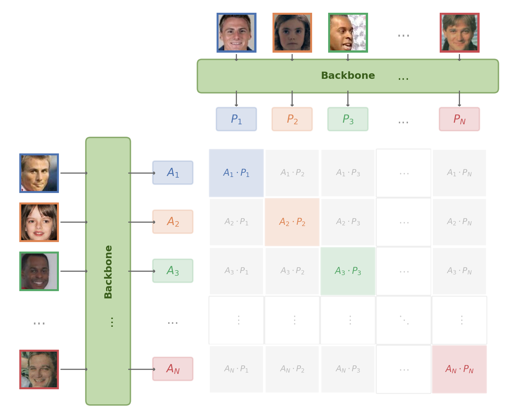

# How far can contrastive loss get us in face verification?

<p align="center">
  
  <br>
  <em>Can CLIP's contrastive loss alone learn to tell faces apart?</em>
</p>

Most modern face verification systems are trained as classifiers &mdash; and then the classifier is thrown away. ArcFace learns a softmax head over identity classes, enforces angular margins, and discards it at inference. InfoNCE offers a more direct path: optimize embedding similarity itself, the same objective behind CLIP. This project puts them head-to-head on the same backbone and data.

## Results

All models trained on MS1M-ArcFace (85K identities), evaluated with 10-fold cross-validation at FAR@0.001.

| Experiment | LFW | CFP-FF | CFP-FP |
|-----------|-----|--------|--------|
| ArcFace (ResNet-50) | 99.72% | 99.80% | 95.84% |
| InfoNCE (ResNet-50) | 99.55% | 99.59% | 87.89% |

InfoNCE nearly matches ArcFace on frontal benchmarks but drops 8 points on CFP-FP (pose variation). I surmise this is largely a supervision asymmetry. Both losses are softmax cross-entropy &mdash; the difference is what goes in the denominator:

$$\mathcal{L}_{\text{ArcFace}} = -\log \frac{e^{s \cos(\theta_{y_i} + m)}}{e^{s \cos(\theta_{y_i} + m)} + \sum_{j \neq y_i}^{N} e^{s \cos \theta_j}}$$

$$\mathcal{L}_{\text{InfoNCE}} = -\log \frac{e^{z_i \cdot z_i^{+} / \tau}}{\sum_{k \neq i}^{2P} e^{z_i \cdot z_k / \tau}}$$

In ArcFace, each sample is pulled toward one positive class center and pushed away from all other 85,741 centers &mdash; fixed and always present. In InfoNCE, each sample is pulled toward one positive and pushed away from 1,448 other samples in the mini-batch &mdash; these change every iteration. CLIP uses 32,768-size batches; this suggests that increasing batch size may help narrow InfoNCE’s performance gap on harder benchmarks such as CFP-FP.

However, InfoNCE’s lack of fixed class centers may be a structural advantage for face verification. ArcFace embeds all faces on a hypersphere populated by 85,741 learned class centers &mdash; at inference, unseen faces tend to snap to the nearest center rather than occupying their own region of the space (see [embedding space analysis](#embedding-space-analysis) below). InfoNCE has no such centers: the embedding space is shaped entirely by pairwise similarity, which may allow unseen identities to distribute more freely.

## Side experiments

### Does adding contrastive loss help ArcFace?

Hybrid loss (ArcFace + 0.5 &times; InfoNCE) yields no improvement &mdash; contrastive regularization adds nothing over ArcFace’s margin alone. Config: `configs/arc-nce.yaml`

| Experiment | LFW | CFP-FF | CFP-FP |
|-----------|-----|--------|--------|
| ArcFace (ResNet-50) | 99.72% | 99.80% | 95.84% |
| InfoNCE (ResNet-50) | 99.55% | 99.59% | 87.89% |
| **ArcFace + InfoNCE (ResNet-50)** | **99.72%** | **99.73%** | **95.30%** |

### Do foundation models transfer to faces?

Frozen CLIP, DINOv2, and I-JEPA perform poorly for identity discrimination (52&ndash;68% LFW), indicating that generic visual pretraining does not yield face-discriminative embeddings. Config: `configs/clip.yaml`, `configs/dino.yaml`, `configs/jepa.yaml`

| Experiment | LFW | CFP-FF | CFP-FP |
|-----------|-----|--------|--------|
| ArcFace (ResNet-50) | 99.72% | 99.80% | 95.84% |
| InfoNCE (ResNet-50) | 99.55% | 99.59% | 87.89% |
| ArcFace + InfoNCE (ResNet-50) | 99.72% | 99.73% | 95.30% |
| **CLIP ViT-B/32 (frozen)** | **68.35%** | **69.01%** | **56.69%** |
| **DINOv2 ViT-B/14 (frozen)** | **57.85%** | **51.39%** | **50.43%** |
| **I-JEPA ViT-H/14 (frozen)** | **52.57%** | **51.64%** | **50.13%** |

### LoRA adaptation of foundation models

LoRA (rank=8, <1% trainable params) with InfoNCE recovers foundation models to 89&ndash;96% LFW. DINOv2 leads on CFP-FF (96.81%), but all remain well below ResNet-50 trained from scratch. Config: `configs/clip-lora.yaml`, `configs/dino-lora.yaml`, `configs/jepa-lora.yaml`

| Experiment | LFW | CFP-FF | CFP-FP |
|-----------|-----|--------|--------|
| ArcFace (ResNet-50) | 99.72% | 99.80% | 95.84% |
| InfoNCE (ResNet-50) | 99.55% | 99.59% | 87.89% |
| ArcFace + InfoNCE (ResNet-50) | 99.72% | 99.73% | 95.30% |
| CLIP ViT-B/32 (frozen) | 68.35% | 69.01% | 56.69% |
| DINOv2 ViT-B/14 (frozen) | 57.85% | 51.39% | 50.43% |
| I-JEPA ViT-H/14 (frozen) | 52.57% | 51.64% | 50.13% |
| **CLIP ViT-B/32 + LoRA** | **96.08%** | **89.79%** | **72.24%** |
| **DINOv2 ViT-B/14 + LoRA** | **94.78%** | **96.81%** | **78.50%** |
| **I-JEPA ViT-H/14 + LoRA** | **89.12%** | **89.57%** | **72.73%** |

### Embedding space analysis

I wondered &mdash; ArcFace trains a classifier over 85K identities and discards it at inference. How does it generalize to unseen faces?

ArcFace’s final layer is a matrix of 85,741 L2-normalized class centers. During training, each embedding is pushed toward its own class center on the hypersphere. A well-trained model maps every training image close to one of these centers. But when an unseen identity is fed through the frozen model, will it also land close to a class center?

To test this, I took the positive pairs from LFW, CFP-FF, and CFP-FP and measured two things: (a) the cosine similarity between the two images in a pair, and (b) the cosine similarity between each image and its nearest class center. These results assume MS1M-ArcFace and the evaluation datasets are identity-disjoint.

| Loss | Benchmark | Pair sim | Nearest center sim (A) | Nearest center sim (B) | % A closer to center | % B closer to center |
|------|-----------|----------|------------------------|------------------------|----------------------|----------------------|
| ArcFace | LFW | 0.714 | 0.630 | 0.631 | 43.3% | 44.8% |
| ArcFace | CFP-FF | 0.711 | 0.725 | 0.727 | 65.6% | 66.4% |
| ArcFace | CFP-FP | 0.515 | 0.726 | 0.573 | 90.2% | 77.1% |
| ArcFace+InfoNCE | LFW | 0.776 | 0.676 | 0.678 | 33.9% | 35.3% |
| ArcFace+InfoNCE | CFP-FF | 0.780 | 0.767 | 0.769 | 53.3% | 53.1% |
| ArcFace+InfoNCE | CFP-FP | 0.589 | 0.769 | 0.617 | 89.7% | 65.2% |

On LFW (easy, frontal), positive pairs are closer to each other than to any class center &mdash; generalization works as expected. On CFP-FP (pose variation), the picture flips: the frontal face snaps to a nearby class center (0.73) while the profile face drifts further (0.57), and pair similarity drops to 0.52. 90% of frontal faces are closer to a training class center than to their profile pair partner. The model leans on the class-center geometry learned during training, which breaks under pose variation. Script: `scripts/analyze_center_vs_positive.py`

## Background

Face verification determines whether two face images belong to the same person &mdash; a pairwise similarity problem.

**FaceNet** (Schroff et al., CVPR 2015) was the first to frame it this way: triplet loss maps faces to a compact Euclidean space, and the embedding is used directly at inference. However, triplet mining is slow and unstable at scale.

**Margin-based losses** &mdash; SphereFace (Liu et al., CVPR 2017), CosFace (Wang et al., CVPR 2018), ArcFace (Deng et al., CVPR 2019) &mdash; reframe verification as multi-class classification during training. A softmax head over identity classes is added, angular margins enforce inter-class separation, and the classification head is discarded at inference. This indirect approach became the dominant paradigm.

**CoReFace** (Song & Wang, Pattern Recognition 2024) is the closest prior work. It adds contrastive regularization on top of margin-based classification to align training with pairwise evaluation. However, contrastive learning serves as a *regularizer* &mdash; the classification head remains the primary signal. This project asks: what happens when contrastive loss is the *only* signal?

## Future work

I invite you, dear reader, to pick up where this project leaves off:

**Embedding space geometry.** Do InfoNCE embeddings truly avoid the class-center snapping observed with ArcFace? Do unseen identities distribute more freely across the hypersphere, or does a different kind of clustering emerge? For ArcFace, do both images in a positive pair snap to the *same* nearest center or to different ones &mdash; and how does this correlate with verification accuracy?

**Larger batch sizes.** The CFP-FP gap may largely be a supervision asymmetry. Scaling batch size is the most natural next step &mdash; just increase `batch_size` in `configs/nce.yaml` and retrain.

**Dataset overlap.** The embedding space analysis assumes MS1M-ArcFace and the evaluation benchmarks are identity-disjoint. Verifying this &mdash; and quantifying any overlap &mdash; is needed to validate those results.

## Experimental setting

- **Training data**: MS1M-ArcFace, 85,741 identities, 80/20 train/val split
- **Hardware**: 2&times; H100 GPUs (ComputeCanada), `accelerate` distributed, FP16 mixed precision
- **Evaluation**: LFW, CFP-FF, CFP-FP &mdash; 10-fold cross-validation at FAR@0.001
- **Losses**: All embeddings L2-normalized. ArcFace: scale $s=32$, margin $m=0.2$, denominator over all 85,741 class centers. InfoNCE: temperature $\tau=0.07$, denominator over $2P-2$ batch negatives (1,448 for ResNet, up to 4,098 for CLIP-LoRA)
- **ResNet-50 experiments**: SGD (momentum 0.9, WD 5e-4), LR 0.1, 5 warmup epochs, 30 total epochs, batch size 1,350&ndash;1,450
- **LoRA experiments**: rank=8, &alpha;=8 on FFN layers. SGD LR 0.001, 15 epochs, batch size varies (120&ndash;4,100 depending on model size)
- **Frozen baselines**: zero-shot evaluation only (no training)

All results reproducible via config files in `configs/`:

```bash
accelerate launch train.py --config <config_name>
```

## Setup

```bash
conda env create -f environment.yaml
conda activate face-verification
cp .env.example .env  # fill in your dataset paths and HPC credentials
```

## Data

### MS1M-ArcFace (training)

1. Download from Kaggle: https://www.kaggle.com/datasets/jadesag3/ms1m-arcface/data
2. Extract &mdash; you need `train.rec` and `train.idx` (RecordIO format).
3. Set `MS1M_DIR` in `.env` to the extracted folder.

`train.py` automatically converts RecordIO to LMDB on first run.

### LFW (evaluation)

No manual download needed. `train.py` auto-downloads LFW from figshare, runs RetinaFace alignment, and caches the result as `data/lfw_10fold_original_retinaface.lmdb`.

### CFP (evaluation)

Download from Kaggle: https://www.kaggle.com/datasets/chinafax/cfpw-dataset and extract to `data/cfp-dataset/`. LMDBs are prepared automatically on first run.

## Run

```bash
accelerate launch train.py --config arc
```

## SLURM cluster

```bash
sbatch hpc/_requirements_installation.sh   # one-time env setup
cd hpc && bash _download_models.sh          # pre-download weights (login node, has internet)
sbatch hpc/arc.sh                           # submit training job
```